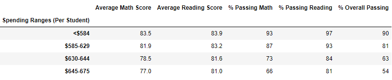

# School_District_Analysis
Analysis of School grading data to make informed decisions for the budget.

## Overview of the school district analysis:
An analysis of the Schools Grading data was done to make informed decisions with respect to the budget by the PyCity School board. But, it was discovered that there was academic dishonesty with respect to reading and math grades of 9th grade students from Thomas High School. So, the PyCity School board wants this data replaced with NaNs and have the analysis done again to see how this affects the overall analysis.

## Results:
### 1. How is the district summary affected?
   Generally, grade averages are usually formatted to one decimal place because averages taken to the hundredths (range: 0.01–0.09) or lower do not impact an average as much as tenths of a grade point, (range: 0.1–0.9). Similarly, grade percentages are formatted to the whole percentage because the tenths of a percent is equivalent to thousandths of a value, or grade. This is because, like averages, thousandths of a grade don't have an impact on the overall percentage because they are so small.
   
   Looking the output summary below, it looks there is **very small** change between the two outputs.
    
   **District Summary for complete Dataset:**
   
   
   **District Summary after replacing Thomas High School's 9th grade students scores with NaNs:**
   

---
### 2. How is the school summary affected?
   As you can see below, only Thomas High School's data is affected by replacing the 9th grade scores with NaNs. The percentages are heavly impacted but the averages are affected only to the tenth decimal place.
   
   **School Summary Complete Dataset:**
   
   
   **School Summary after replacing Thomas High School's 9th grade students scores with NaNs:**
   
   
   But, the percentages improve once the 9th grade students' scores are excluded from the calculations as seen in the below screenshot.
   
   **School Summary after ignoring Thomas High School's 9th grade students scores:**
    
 
---
### 3. How does replacing the ninth graders’ math and reading scores affect Thomas High School’s performance relative to the other schools?
   As seen in the above screenshot the performance of Thomas High School **goes down significantly** when we include the 9th grade students data with the scores replaced with NaNs. But, if we ignore the 9th grade students records completely then the performance is similar to the output from complete dataset.

- When looking at relative performance to other schools, Thomas High School is in **2nd place**.

- But if the 9th grade students scores is replaced with NaNs, then Thomas High School falls to **8th place**.

- Instead of replacing, if 9th grade students records are excluded, then Thomas High School moves back to **2nd place** with respect to Overall Passing percentage.

---

### 4. How does replacing the ninth-grade scores affect the following:
---
#### Math and reading scores by grade:
---
As shown below the ninth-grade scores will show as NaN for Thomas High School Math and Reading scores.
- Math and Reading Scores By Grade: Complete dataset

- Math and Reading Scores By Grade: After replacing 9th grade scores with NaNs

 

---
#### Scores by school spending:
---
When we compare the formatted data, there appears to be no impact but when decimals are considered there is impact at hundredth decimal except for Overall Passing Percentage, which is impacted at tenth decimal place.

- Scores by School Spending: Complete dataset versus Dataset with NaNs
 

- Scores by School Spending with Decimals: Complete dataset versus Dataset with NaNs

---
#### Scores by school size
---
When we compare the formatted data, there appears to be no impact but when decimals are considered there is impact at hundredth decimal except for Overall Passing Percentage, which is impacted at tenth decimal place.

- Scores by School Size: Complete dataset versus Dataset with NaNs

- Scores by School Size with Decimals: Complete dataset versus Dataset with NaNs

---
#### Scores by school type
---
When we compare the formatted data, there appears to be no impact but when decimals are considered there is impact at hundredth decimal except for Overall Passing Percentage, which is impacted at tenth decimal place.

- Scores by School Type: Complete dataset versus Dataset with NaNs

- Scores by School Type with Decimals: Complete dataset versus Dataset with NaNs

## Summary: 
The four changes in the updated school district analysis after reading and math scores for the ninth grade at Thomas High School have been replaced with NaNs are -
1. At District level, there is a **slight** impact to **the tenth decimal value** for Reading and Math Score averages and their Passing percentages.
2. At School level, only Thomas High School is affected. Its overall performace drops drastically pushing it from 2nd place to 8th place with respect to other schools,
3. At School level, if the NaNs records are excluded from computation then Thomas High School climbs back to its 2nd place with respect overall performance,
4. And finally, there is no significant impact with respect to school size, school spending and school type, and
